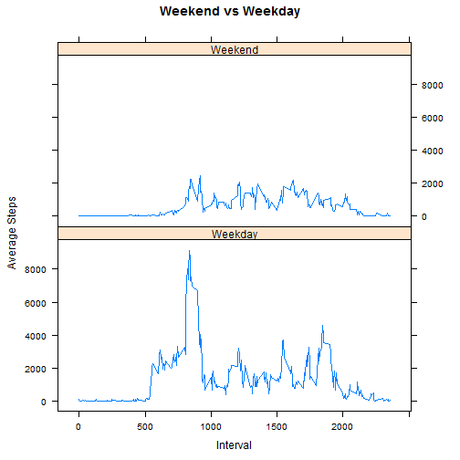

setwd("C:/Users/Admin/Desktop/Coursera/Assignments/E - Reporduceable Research/Assignment 1 As Submitted")
knit2html("PA1_template.Rmd", force_v2=TRUE)

---
title: "Reproducible Research: Peer Assessment 1"
output: 
  html_document:
    keep_md: true
---
# Loading and preprocessing the data
  Show any code that is needed to
  
  1. Load the data (i.e. )

```r
A <- read.csv("C:/Users/Admin/Desktop/Coursera/R/activity.csv")
```

  2. Process/transform the data (if necessary) into a format suitable for your analysis


# What is mean total number of steps taken per day?
  For this part of the assignment, you can ignore the missing values in the dataset.
  
  1. Calculate the total number of steps taken per day

```r
  B <- summarize(group_by(A, date), steps = sum(steps, na.rm = TRUE))
  head(B, 5)
```

```
## # A tibble: 5 x 2
##         date steps
##       <fctr> <int>
## 1 2012-10-01     0
## 2 2012-10-02   126
## 3 2012-10-03 11352
## 4 2012-10-04 12116
## 5 2012-10-05 13294
```

  2. Make a histogram of the total number of steps taken each day

```r
  hist(B$steps)
```


  3. Calculate and report the mean and median of the total number of steps taken per day

```r
  mean <- mean(B$steps)
  mean
```

```
## [1] 9354.23
```

```r
  median <- median(B$steps)
  median
```

```
## [1] 10395
```

# What is the average daily activity pattern?
  1. Make a time series plot (i.e. ) of the 5-minute interval (x-axis) and the average number of steps taken, averaged
across all days (y-axis)

```r
  C <- summarize(group_by(A, interval), meansteps = mean(steps, na.rm = TRUE))
  plot(C, type = "l")
```


  2. Which 5-minute interval, on average across all the days in the dataset, contains the maximum number of steps?

```r
  C <- arrange(C, desc(meansteps))
  head(C, 1)
```

```
## # A tibble: 1 x 2
##   interval meansteps
##      <int>     <dbl>
## 1      835  206.1698
```

# Imputing missing values
Note that there are a number of days/intervals where there are missing values (coded as ). The presence of missing days may
introduce bias into some calculations or summaries of the data.

  1. Calculate and report the total number of missing values in the dataset (i.e. the total number of rows with [NA]s)

```r
  there <- A[!is.na(A$steps) == TRUE,]
  missing <- A[!is.na(A$steps) == FALSE,]
  nrow(missing)
```

```
## [1] 2304
```
  
  2. Devise a strategy for filling in all of the missing values in the dataset. The strategy does not need to be sophisticated. For example, you could use the mean/median for that day, or the mean for that 5-minute interval, etc.

The answer is, as always,  42. 

```r
  doctored <- mutate(missing, steps = 42)
```

  3. Create a new dataset that is equal to the original dataset but with the missing data filled in.

```r
  D <- bind_rows(there, doctored)
```

  4. Make a histogram of the total number of steps taken each day and Calculate and report the mean and median total number of steps taken per day. 

```r
  E <- summarize(group_by(D, date), steps = sum(steps))
  hist(E$steps)
```


```r
  mean <- mean(E$steps)
  mean
```

```
## [1] 10940.59
```

```r
  median <- median(E$steps)
  median
```

```
## [1] 11458
```

* Do these values differ from the estimates from the first part of the assignment? 

```r
  graph=plot_ly(x = B$steps, opacity = 0.55, type = "histogram", name = "Original") %>%
        add_trace(x = E$steps, opacity = 0.55, type = "histogram", name = "Altered") %>%
        layout(barmode="overlay") #   >%>
  graph
```

```
## Error in loadNamespace(name): there is no package called 'webshot'
```

# What is the impact of imputing missing data on the estimates of the total daily number of steps?
* The daily step count is inflated.  The historgram appears to a bit whacko. Maybe the answer isn't always 42. . 

# Are there differences in activity patterns between weekdays and weekends?

  1. Create a new factor variable in the dataset with two levels - "weekday" and "weekend" indicating whether a given date is a weekday or weekend day.
  
  * Calling the weekday function

```r
L <-mutate(A, weekday = weekdays(as.Date(A$date)))
```

  * A weekend in Baltimore, USA is considered Saturday and Sunday. 

```r
weekend <- c("Saturday", "Sunday")
is_weekend <-function(weekday){ifelse(weekday %in% weekend,"Weekend","Weekday")}
M <-mutate(L, Is_Weekend=is_weekend(weekday))
M <- summarize(group_by(M, interval, Is_Weekend), steps = sum(steps, na.rm = TRUE))
```

  2. Make a panel plot containing a time series plot (i.e. ) of the 5-minute interval (x-axis) and the average number of
steps taken, averaged across all weekday days or weekend days (y-axis). See the README file in the GitHub repository to see an example of what this plot should look like using simulated data.

```r
N <- xyplot(M$steps~M$interval|M$Is_Weekend,
          layout = (c(1,2)),type = "l", xlab = "Interval", ylab = "Average Steps", main = "Weekend vs Weekday")
N
```



